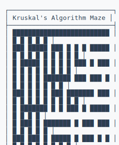
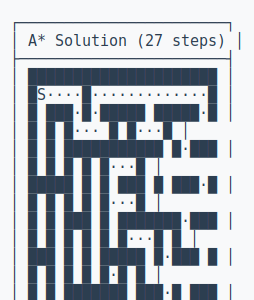

# Maze Gallery

Visual examples showcasing different algorithms and solving methods.

## Generation Algorithms

| Algorithm | Description | Example |
|-----------|-------------|---------|
| **DFS** | Long winding passages |  |
| **Kruskal** | Uniform distribution |  |
| **Prim** | Short passages, more branching |  |

## Solving Algorithms

| Algorithm | Description | Example |
|-----------|-------------|---------|
| **A*** | Optimal with heuristics |  |
| **Dijkstra** | Guaranteed shortest path | <details><summary>View Solution</summary><pre>┌───────────────────────────┐<br>│ Dijkstra Solution (37 steps) │<br>├───────────────────────────┤<br>│ █████████████████████████ │<br>│ █S█·······█···········  █ │<br>│ █·█·█████·█·█████████·███ │<br>│ █·█·····█···█   █   █···█ │<br>│ █·█████·█████ █ ███ ███·█ │<br>│ █·····█·█     █       █·█ │<br>│ █████·█·█ ███████ █████·█ │<br>│ █                     █E█ │<br>│ █████████████████████████ │<br>└───────────────────────────┘</pre></details> |
| **BFS** | Level-by-level exploration | <details><summary>View Solution</summary><pre>┌───────────────────────────┐<br>│ BFS Solution (37 steps)   │<br>├───────────────────────────┤<br>│ █████████████████████████ │<br>│ █S█·······█···········  █ │<br>│ █·█·█████·█·█████████·███ │<br>│ █·█·····█···█   █   █···█ │<br>│ █·█████·█████ █ ███ ███·█ │<br>│ █·····█·█     █       █·█ │<br>│ █████·█·█ ███████ █████·█ │<br>│ █                     █E█ │<br>│ █████████████████████████ │<br>└───────────────────────────┘</pre></details> |

## Algorithm Comparison

[Side-by-side comparison](comparisons/algorithm_comparison.md) of different algorithms using the same seed.

## Output Formats

### ASCII Format
<details>
<summary>Click to view ASCII maze</summary>

```
+-+-+-+-+-+-+-+-+-+-+
|S ·|       | | |   |
+-+ +-+ +-+-+ + +-+ +
|· ·        |       |
+ +-+-+-+-+-+ +-+-+ +
|· · ·  | | |   |   |
+ + + +-+ + + +-+-+-+
| | |· ·  |         |
+ + +-+ +-+-+-+ + + +
| | | |·|  · ·  | | |
+-+-+ + +-+ + +-+-+-+
|      · · ·|·|  · ·|
+ + +-+-+-+-+ +-+ + +
| |       |  ·|· ·|·|
+ + + + +-+-+ + +-+ +
| | | | |    · ·|  E|
+-+-+-+-+-+-+-+-+-+-+
```

</details>

### SVG Format
Use the algorithm examples above - they're all in SVG format for scalable, high-quality display.

## Quick Start

Generate your own examples:

```bash
# Run interactive demo
python demo/run_demo.py

# Generate specific maze
maze-gen generate 15 12 --algorithm dfs --format png

# Solve a maze
maze-gen solve 12 10 --gen-algorithm kruskal --solve-algorithm astar
```

## Directory Structure

```
gallery/
├── algorithms/     # Generation examples
├── solutions/      # Solving examples
├── formats/        # Output format demos
└── comparisons/    # Algorithm comparisons
```
